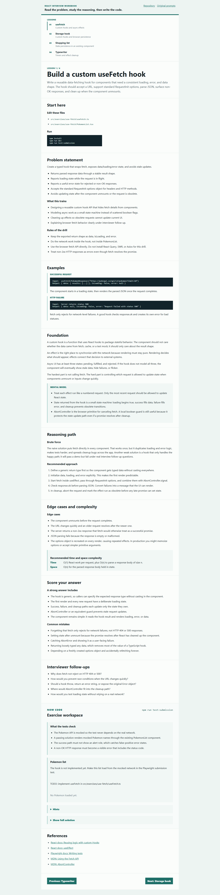
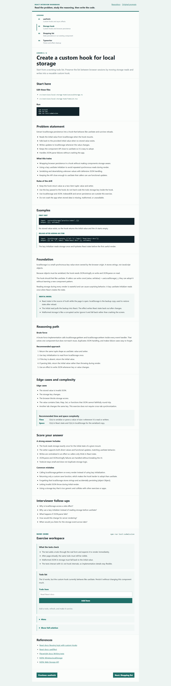
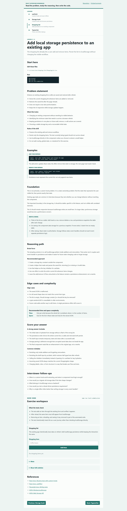
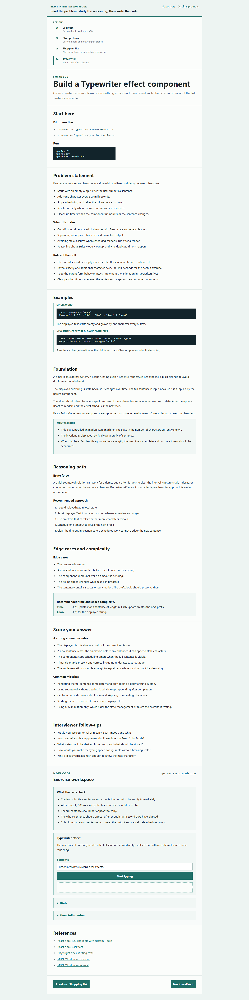

# React Interview Practice Lab

One Vite React repo for four interview-sized exercises inspired by React Practice:

- [Build a custom useFetch hook](https://reactpractice.dev/exercise/build-a-custom-usefetch-hook/)
- [Create a custom hook that saves items to localStorage](https://reactpractice.dev/exercise/create-a-custom-hook-that-allows-saving-items-to-the-local-storage/)
- [Add persistence to localStorage for an existing app](https://reactpractice.dev/exercise/add-persistence-to-local-storage-for-an-existing-app/)
- [Build a Typewriter effect component](https://reactpractice.dev/exercise/build-a-typewriter-effect-component/)

The original starter templates are intentionally not copied here. This project gives you one modern React 19 + Vite workspace, single-column lessons, NeetCode-style hints and complexity notes, hidden full solutions, starter canvases, clear acceptance checks, and Playwright submission tests. The challenge files themselves are not solved yet.

## What

This repo is a compact practice lab. Each page gives you the prompt, examples, foundations, mental model, brute-force discussion, optimal approach, edge cases, complexity target, interview follow-ups, starter canvas, hints, and a hidden full solution.

Each challenge also includes an interview rubric:

- What the exercise is training.
- The rules of the drill.
- What a strong answer should include.
- Common mistakes to avoid.
- What the Playwright submission tests check.



## Why

These four exercises cover the mechanics interviewers often probe:

- Custom hooks: API design, state shape, effect dependencies, and reusable logic.
- Fetching data: loading states, errors, request options, and cleanup.
- localStorage: browser persistence, JSON serialization, reload behavior, and failure cases.
- Timers: cleanup, Strict Mode behavior, and UI updates over time.

The goal is to remove setup friction. Clone once, run one app, then practice the exact behaviors.

## How

```bash
npm install
npm run dev
```

Open the local URL printed by Vite, choose an exercise, and edit the starter file listed on the page.

Run the smoke tests for the documentation site:

```bash
npm run test:e2e
```

Run the submission checks when you want to test your implementations:

```bash
npm run test:submission
```

The submission tests are expected to fail before you implement the exercises.

## Exercise Pages

### 1. useFetch


Build a typed `useFetch` hook that returns `data`, `isLoading`, and `error`, supports request options, handles non-OK responses, and avoids stale state updates.

Work in:

- `src/exercises/use-fetch/useFetch.ts`
- `src/exercises/use-fetch/PokemonList.tsx`

Useful docs:

- [React custom Hooks](https://react.dev/learn/reusing-logic-with-custom-hooks)
- [React useEffect](https://react.dev/reference/react/useEffect)
- [MDN Fetch API](https://developer.mozilla.org/en-US/docs/Web/API/Fetch_API/Using_Fetch)
- [MDN AbortController](https://developer.mozilla.org/en-US/docs/Web/API/AbortController)

### 2. localStorage Hook



Create a custom hook that keeps a todo list in localStorage across reloads while preserving a familiar `useState`-like API.

Work in:

- `src/exercises/local-storage-hook/useLocalStorage.ts`
- `src/exercises/local-storage-hook/TodoList.tsx`

Useful docs:

- [React custom Hooks](https://react.dev/learn/reusing-logic-with-custom-hooks)
- [MDN localStorage](https://developer.mozilla.org/en-US/docs/Web/API/Window/localStorage)
- [MDN Web Storage API](https://developer.mozilla.org/en-US/docs/Web/API/Web_Storage_API)

### 3. Shopping List Persistence



Take an existing shopping list and make it survive refreshes. This version does not require a custom hook, but you can extract one if it makes your explanation cleaner.

Work in:

- `src/exercises/shopping-list/ShoppingList.tsx`

Useful docs:

- [React useEffect](https://react.dev/reference/react/useEffect)
- [MDN localStorage](https://developer.mozilla.org/en-US/docs/Web/API/Window/localStorage)
- [Playwright writing tests](https://playwright.dev/docs/writing-tests)

### 4. Typewriter Effect



Given a sentence, show nothing at first, then reveal one character every 500ms until the sentence is complete.

Work in:

- `src/exercises/typewriter/TypewriterEffect.tsx`
- `src/exercises/typewriter/TypewriterPractice.tsx`

Useful docs:

- [React useEffect](https://react.dev/reference/react/useEffect)
- [MDN setTimeout](https://developer.mozilla.org/en-US/docs/Web/API/Window/setTimeout)
- [MDN setInterval](https://developer.mozilla.org/en-US/docs/Web/API/Window/setInterval)

## Testing Philosophy

`npm run test:e2e` checks the learning site itself: lesson navigation, hidden hints, solution reveal controls, and starter canvases.

`npm run test:submission` checks exercise behavior. These tests are deliberately behavioral, not implementation-specific:

- The fetch test mocks the Pokemon API.
- The fetch error test confirms non-OK HTTP responses become visible errors.
- The storage tests add items, reload the page, and expect them to remain.
- The storage tests also cover corrupted JSON and removal persistence.
- The typewriter test checks the 500ms character reveal.
- The typewriter reset test checks that a new sentence cancels old scheduled work.

## GitHub Pages

This repo deploys the app with GitHub Actions. The workflow runs linting, smoke tests, and a production build, then publishes `dist` to GitHub Pages.

The Vite production base path is set to `/react-interview-practice-lab/`, so the deployed site works as a GitHub project page.

## Attribution

The exercise ideas come from [React Practice](https://reactpractice.dev/). This repo includes original summaries, starter code, and screenshots of this local practice lab rather than copying the full original prompts or proprietary assets.
